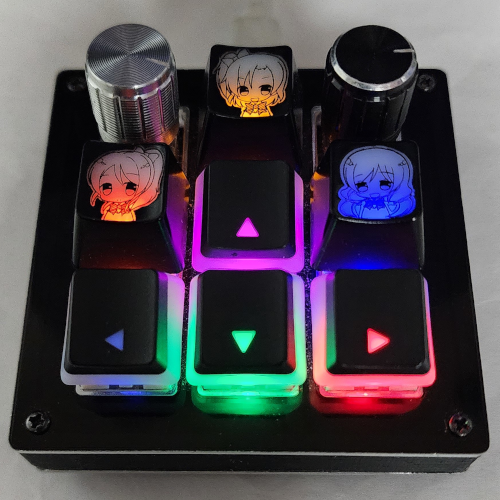
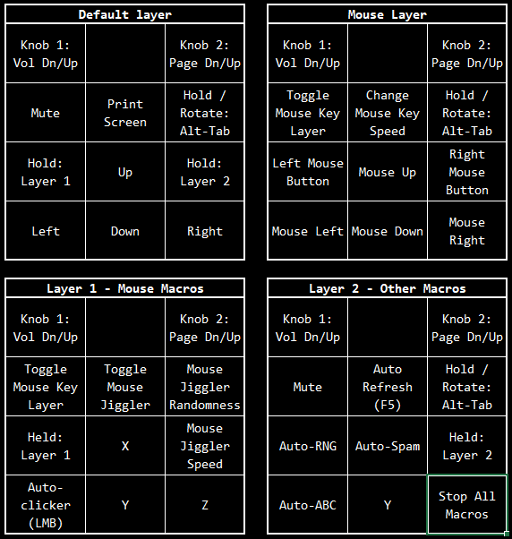

# Custom BDN9 Keymap
Customized keymap and macros for my personal BDN9 macropad with a Proton C.

Auto-clicker, auto-F5, mouse jiggler, mouse keys, scrolling alt-tab using an encoder.

### Setup / Build / Workflow
Setup QMK env, assuming the repo is dumped into `~/qmk_firmware`.

From the clone of this repo:

	cp -r keyboards ~/qmk_firmware/
	qmk compile -kb keebio/bdn9 -km vs-w

Output to flash: `~/qmk_firmware/keebio_bdn9_rev1_vs-w_proton_c.bin`